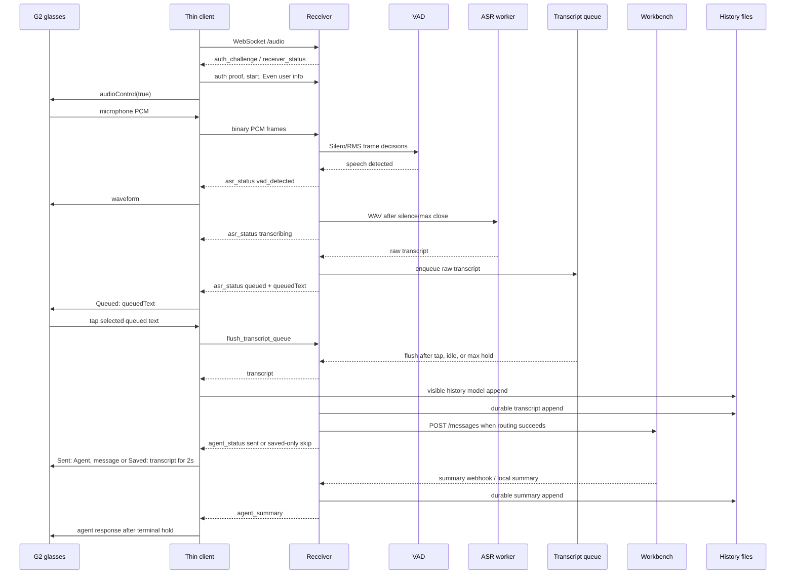

# Interaction Flow And Status Display

This document maps the current interaction path from speaking into the G2
microphone through ASR, transcript cleanup, Workbench routing, agent responses,
history, detail views, and the live `Queued:` / `Sent:` / `Saved:` status shown
on glasses.

## End-To-End Flow



## Auth And Startup Checks

1. The client reads private/public receiver endpoints and the shared secret from
   QR params, Even local storage, or browser local storage.
2. The client creates one full-size status text container plus a tiny event
   capture container.
3. The client opens `/audio`.
4. If shared-secret auth is enabled, the receiver sends `auth_challenge`.
5. The client replies with `auth` using `HMAC-SHA256(nonce, shared_secret)`.
6. The receiver rejects non-auth messages before transport auth succeeds.
7. After auth, the client sends `start` with source, encoding, sample rate,
   channels, and optional Even user info.
8. If user allow-list auth is configured, the receiver rejects unapproved Even
   users before accepting audio.
9. Once accepted, the client enables G2 mic streaming.

Preserved safety checks:

- bad or missing shared-secret proof rejects the socket;
- disallowed Even users cannot stream audio;
- reconnect starts private-first after a connected socket drops;
- socket close clears active speech state and disables audio.

## Audio, VAD, And ASR

The receiver owns endpointing and transcription.

1. G2 PCM frames arrive as binary WebSocket frames.
2. `VadEndpoint` keeps pre-roll and asks Silero VAD for speech decisions, with
   RMS fallback.
3. First detected speech sends:

```json
{ "type": "asr_status", "status": "vad_detected", "backend": "silero" }
```

4. The client dismisses startup copy and shows a waveform.
5. Silence or max utterance closes the segment and queues ASR.
6. ASR start sends:

```json
{ "type": "asr_status", "status": "transcribing", "jobId": 3, "file": "..." }
```

7. Empty ASR sends `asr_status: no_transcript`.
8. Non-empty ASR enters the transcript queue and sends `asr_status: queued`.

## Transcript Queue

The queue combines nearby ASR segments so a short pause does not split one user
intent into separate commands.

Flush waits until:

- `transcriptQueue.idleMs` passes after the latest queued text or VAD activity;
- no speech segment is active;
- no ASR job is pending;
- or `transcriptQueue.maxHoldMs` forces a flush.

A tap while queued text is selected sends the authenticated
`flush_transcript_queue` control. That flushes the completed ASR items already
in the user's queue immediately; an unfinished speech segment remains a later
queue item.

Queued event:

```json
{
  "type": "asr_status",
  "status": "queued",
  "queuedSegments": 2,
  "queuedText": "Pike update the docs and run the history test",
  "text": "Pike update the docs and run the history test",
  "debounceMs": 3000,
  "activeSegments": 0,
  "pendingAsrJobs": 0
}
```

The client treats `queuedText` as the canonical appended text. It replaces the
previous queued display with the server aggregate instead of concatenating on
the client.

## Cleanup And Persistence

On flush:

1. If cleanup is enabled, the receiver sends `asr_status: cleaning`.
2. Cleanup either returns corrected text or falls back to raw text.
3. The cleanup guard preserves command words, such as
   `Wolf terminate session`.
4. The receiver writes raw audio, WAV, raw transcript, clean transcript, and
   metadata.
5. The receiver appends durable message history.
6. The receiver sends `transcript`.

The `transcript` event appends client-visible history but no longer clears the
live queued display. The live display remains `Queued:` until Workbench routing
reports whether the transcript was sent, saved, or failed.

## Workbench Routing Checks

`workbench-router.js` decides whether cleaned text should be sent to an agent.

Outcomes:

- `agent + message`: send to Workbench.
- `agent only`: arm that agent for the next transcript and save the utterance.
- `pending agent + message`: send message to the armed agent.
- missing agent prefix while `requireAgentPrefix` is true: save only.
- empty transcript: clear speech processing with no saved label.
- Workbench disabled or unconfigured: save only.
- Workbench HTTP failure or timeout: display an error.

Successful send:

```json
{
  "type": "agent_status",
  "status": "sent",
  "agent": "Pike",
  "message": "update the docs and run the history test",
  "jobId": 3
}
```

Saved-only skip:

```json
{
  "type": "agent_status",
  "status": "missing_agent_prefix",
  "agent": "",
  "jobId": 3
}
```

## Live Display Contract

| Event | Glasses live text | Hold |
| --- | --- | --- |
| `asr_status: queued` | `Queued: <queuedText>` | until terminal status |
| later `asr_status: queued` | `Queued: <updated queuedText>` | until terminal status |
| `transcript` | keep current `Queued:` | no terminal hold |
| `agent_status: sending` | keep current `Queued:` | no terminal hold |
| `agent_status: sent` | `Sent: Pike, <message>` | 2 seconds |
| `missing_agent_prefix` | `Saved: <transcript>` | 2 seconds |
| `workbench_disabled` | `Saved: <transcript>` | 2 seconds |
| `workbench_unconfigured` | `Saved: <transcript>` | 2 seconds |
| `agent_armed` | `Saved: <agent utterance>` | 2 seconds |
| `agent_error` | error text | normal transcript hold |
| `agent_summary` | response summary | after any active 2s terminal hold |

The sent formatter strips a duplicate leading agent label. If the server sends
`agent: "Pike"` and `message: "Pike update the docs"`, the display becomes:

```text
Sent: Pike, update the docs
```

not:

```text
Sent: Pike, Pike update the docs
```

## History And Details

History remains durable-event driven:

- `transcript` appends a `You` row.
- `agent_summary` appends an agent row with optional detail.
- queued text appears only as pending state in the history Back row.
- tapping that selected pending row requests one queue flush and opens the
  resulting durable transcript detail.
- terminal `Sent:` and `Saved:` states clear pending history state.
- details strip repetitive agent introductions so agent names do not duplicate.

The text-container limits still apply:

- one stable `576 x 288` text container;
- measured wrapping through `@evenrealities/pretext`;
- max update payload of `2000` characters;
- no native scroll dependency;
- serialized bridge writes through the status render queue.
- identical content is not sent to the bridge again, and standby client
  instances do not repaint the shared glasses container.

## Files

- `app/src/main.ts`: socket event handling and live dispatch state.
- `app/src/speechDispatchDisplay.ts`: `Queued:` / `Sent:` / `Saved:`
  formatting and duplicate-agent stripping.
- `app/src/historyNavigator.ts`: pending transcript row and detail navigation.
- `app/src/historyCanvas.ts`: measured history/detail rendering.
- `local-receiver/server.js`: VAD, ASR jobs, transcript queue, cleanup,
  Workbench send, summary webhook, history persistence.
- `local-receiver/workbench-router.js`: agent prefix parsing and pending-agent
  routing.

## Verification

For app changes in this flow, run:

```bash
npm --prefix app run build
npm --prefix app run test:history
npm --prefix app run test:speech-dispatch
```
