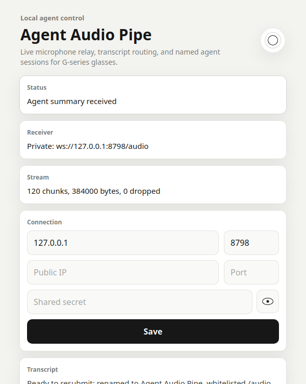
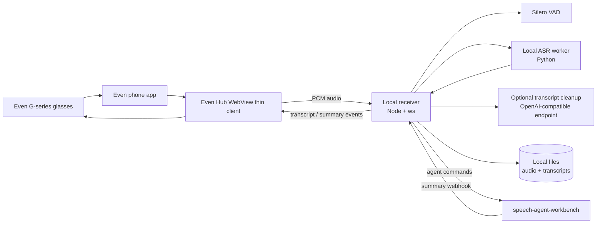
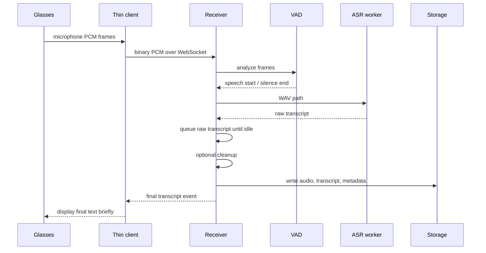
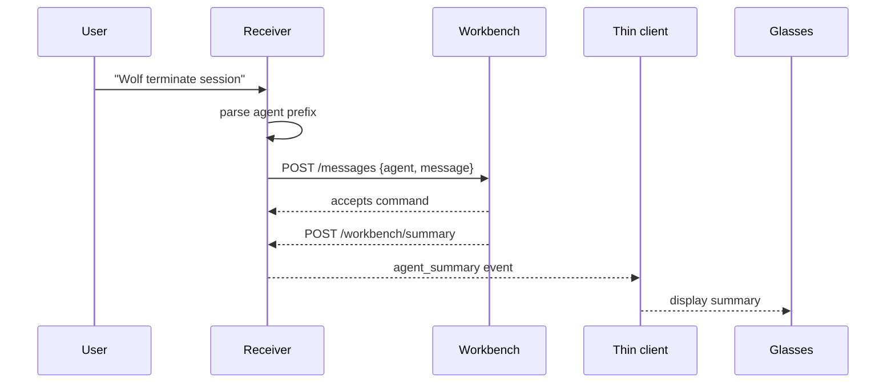
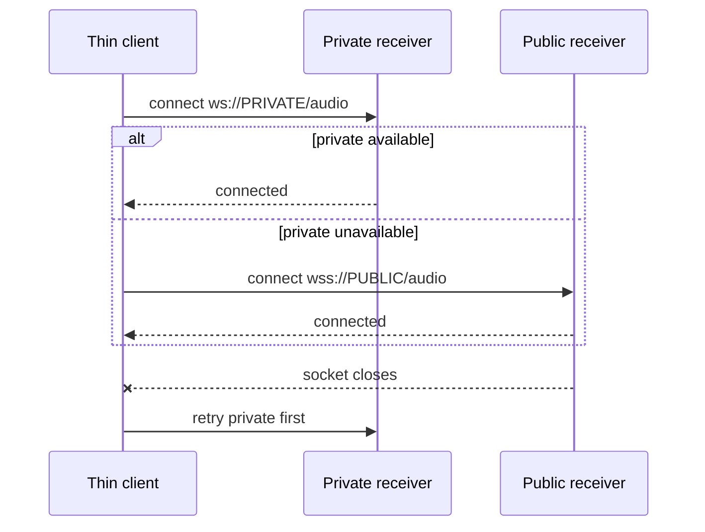

# Agent Audio Pipe

Agent Audio Pipe turns Even Realities G-series glasses into a lightweight voice
relay for local speech tools and coding agents. The sideloaded Even Hub app
streams glasses microphone audio to a local receiver, the receiver transcribes
speech, and final transcripts or agent summaries are sent back to the glasses.

This is a local-first developer tool. Audio, transcripts, ASR, cleanup, and
agent routing stay on your machine unless you configure external endpoints.

## Screenshots




## App Store Summary

**Talk through your glasses. Route commands to named local coding agents. See
the response without pulling out your phone or using the ring.**

Agent Audio Pipe is a companion app for Even Realities glasses that captures
short spoken utterances, transcribes them locally, and optionally forwards
agent-prefixed commands to named Claude, Codex, or other terminal sessions via
[`speech-agent-workbench`](https://github.com/aaronrau/speech-agent-workbench).

**Highlights**

- Streams G-series microphone audio over one WebSocket.
- Uses Silero VAD to detect speech and close utterances.
- Runs local ASR through the included Python worker.
- Shows a small waveform while speaking.
- Shows final transcripts and agent summaries briefly, then clears the live view.
- Keeps history available through the glasses tap menu.
- Supports private `ws://` first, then public `wss://` reconnect behavior.
- Can route commands to multiple named terminal sessions, such as `Flux check
  status` or `Wolf terminate session`.
- Saves raw audio, WAV files, raw transcripts, cleaned transcripts, and metadata.
- Supports optional transcript cleanup through an OpenAI-compatible local model.

## What It Is

Agent Audio Pipe has two parts:

- **Thin client:** a sideloaded Even Hub WebView app. It captures audio, displays
  status/history on glasses, and reconnects to the receiver.
- **Local receiver:** a Node server that receives PCM audio, runs VAD/ASR,
  stores transcripts, routes commands, and sends summaries back to the client.

It does not run a cloud service, manage production auth, or replace the Even app.

## Quick Start

```bash
npm start
```

The launcher will:

1. Detect your LAN IP address.
2. Install app and receiver dependencies if needed.
3. Start the ASR worker, receiver, and Vite sideload app.
4. Generate `app/app.json` with the right network whitelist.
5. Print an Even Hub QR code.
6. Include receiver endpoint hints and an auth secret in the QR URL.

Scan the QR code with the Even app. The packaged app page also has separate
private IP, private port, public IP, public port, and masked shared-secret
fields. Use the receiver port, usually `8788`; `5173` is only the local Vite
app page.

If the wrong network interface is detected:

```bash
EVEN_AUDIO_PIPE_HOST=192.168.1.100 npm start
```

Useful port overrides:

```bash
EVEN_AUDIO_PIPE_APP_PORT=5173 \
EVEN_AUDIO_PIPE_RECEIVER_PORT=8788 \
EVEN_AUDIO_PIPE_ASR_PORT=8790 \
npm start
```

## Tutorial

**1. Start the local stack**

```bash
npm start
```

Wait for the launcher to print:

```text
Agent Audio Pipe
  App URL:        http://YOUR_LAN_IP:5173
  LAN Audio WS:   ws://YOUR_LAN_IP:8788/audio
  Receiver health http://127.0.0.1:8788/health
```

**2. Scan the QR code**

Open the Even app and scan the launcher QR. The sideload page should show the
receiver URL and stream counters.

**3. Speak**

When speech is detected, the glasses show a compact waveform. Queued raw ASR
text is not displayed. Only final transcript text is shown briefly, then the
live view clears.

**4. Open history**

Tap the glasses history control to open recent transcripts and agent summaries.
Tap an item to open detail. Tap again to return to the list. Opening history
clears the transient live transcript display.

**5. Route a command**

Enable the workbench integration, then speak an agent-prefixed command:

```text
Flux pull latest changes
Brock check the tests
Wolf terminate session
```

The receiver sends:

```json
{ "agent": "Wolf", "message": "terminate session" }
```

Ambient speech without an agent prefix is saved and shown, but not sent to the
workbench.

## Features

**Live Speech Relay**

- Captures `pcm_s16le`, 16 kHz, mono audio from Even Hub.
- Sends audio over `/audio` WebSocket.
- Uses VAD to avoid fixed-length clipping.
- Displays a waveform only while speech is active.

**Final Transcript Display**

- Final cleaned transcripts are displayed briefly on glasses.
- Live text clears automatically after the hold period.
- Queued ASR text is kept out of the live/history UI to avoid duplicate display.

**History And Details**

- Recent user transcripts and agent summaries are stored in JSONL.
- Glasses tap navigation opens a list view and detail view.
- Long details page by visual lines to fit the Even text container.

**Private/Public Endpoint Failover**

- The client stores private IP, private port, public IP, public port, and the
  raw shared secret.
- It tries private `ws://PRIVATE/audio` first.
- It tries public `wss://PUBLIC/audio` second.
- After a connected socket drops, reconnect starts from private `ws://` again.

**Local Auth**

- The launcher enables local auth by default.
- QR/dev loading can use a legacy URL token.
- Packaged apps can use shared-secret challenge auth; the raw shared secret is
  not sent in the WebSocket URL.
- The receiver rejects `/audio` WebSocket traffic without a valid token or
  shared-secret proof.
- Optional Even user UID allow-list is supported.

**Speech Agent Workbench**

- Final transcripts can be routed to
  [`speech-agent-workbench`](https://github.com/aaronrau/speech-agent-workbench).
- Agent names are parsed from the first few words.
- Agent-only utterances arm the next transcript.
- Summaries return through `/workbench/summary` and are pushed to glasses.

## Architecture



## Sequence: Audio To Transcript



## Sequence: Workbench Command



## Sequence: Reconnect



## Design Decisions

- **One socket for audio and responses:** The thin client sends binary PCM and
  receives JSON control/results over the same WebSocket.
- **Thin client stays thin:** ASR, cleanup, workbench tokens, and file writes are
  server-side.
- **Final text only:** The client does not display queued ASR text because it can
  duplicate the final transcript.
- **Private-first failover:** `ws://` is preferred for private LAN use. `wss://`
  is the fallback for public WAN or tunnel access.
- **History is pullable:** The client can request message history after
  reconnect or when opening the menu.
- **Text container safe:** Glasses output is paged and capped to fit Even text
  container limits.

## Configuration

Create a local config:

```bash
cp config.example.json config.json
```

`config.json` is ignored by git. Paths may be relative to the repo root or
absolute.

Common sections:

```json
{
  "auth": {
    "enabled": true,
    "token": "",
    "tokenSecret": "",
    "tokenUserId": "",
    "allowedUserIds": []
  },
  "storage": {
    "audioDir": "data/audio",
    "transcriptDir": "data/transcripts",
    "transcriptsLog": "data/transcripts/transcripts.log"
  },
  "network": {
    "lanHost": "auto",
    "publicUrl": "",
    "publicWsUrl": ""
  },
  "workbench": {
    "enabled": false,
    "url": "http://127.0.0.1:8787",
    "agents": ["Flux", "Brock", "Pike", "Wolf"],
    "requireAgentPrefix": true,
    "summaryPath": "/workbench/summary",
    "summaryToken": ""
  },
  "transcriptQueue": {
    "idleMs": 3000,
    "maxHoldMs": 10000
  }
}
```

Use a different config file:

```bash
EVEN_AUDIO_PIPE_CONFIG=/path/to/config.json npm start
```

## Auth

For the packaged app, put `config.auth.tokenSecret` in the masked Shared Secret
field. The raw secret is not sent over the WebSocket. The receiver sends a nonce,
the client replies with `HMAC-SHA256(nonce, tokenSecret)`, and the receiver
compares the proof.

The launcher still adds a legacy token to the QR URL for local QR/dev loading:

```text
QR URL: http://YOUR_IP:5173?t=TOKEN&private=YOUR_IP:8788&public=PUBLIC_IP:8788
Audio:  ws://YOUR_IP:8788/audio?t=TOKEN
```

Use a stable token:

```json
{
  "auth": {
    "enabled": true,
    "token": "change-me"
  }
}
```

Use a UID-derived token:

```json
{
  "auth": {
    "enabled": true,
    "tokenSecret": "local-secret-value",
    "tokenUserId": "12345",
    "allowedUserIds": ["12345"]
  }
}
```

When `tokenSecret` and a UID are available, the launcher derives the audio token
with `HMAC-SHA256(uid, tokenSecret)`. The receiver also receives Even user info
from `bridge.getUserInfo()` and can restrict access by `allowedUserIds`.

Disable local auth:

```bash
EVEN_AUDIO_PIPE_AUTH=off npm start
```

## ASR And VAD

Default VAD:

```bash
ASR_CHUNK_MODE=vad \
VAD_BACKEND=silero \
SILERO_VAD_FRAME_SAMPLES=512 \
SILERO_VAD_THRESHOLD=0.5 \
VAD_SILENCE_MS=240 \
npm start
```

Disable ASR and record audio only:

```bash
EVEN_AUDIO_PIPE_ASR=off npm start
```

Use an external ASR worker:

```bash
ASR_WORKER_URL=http://127.0.0.1:8790 npm start
```

Use a custom recognizer:

```bash
ASR_COMMAND='your-asr --input {wav}' npm start
```

`ASR_COMMAND` may use these placeholders:

```text
{pcm} raw PCM path
{wav} converted WAV path
{txt} transcript output path
{rawTxt} raw transcript output path
{cleanTxt} cleaned transcript output path
{json} metadata path
```

## Transcript Cleanup

Cleanup is optional. It sends queued raw transcript text to an OpenAI-compatible
chat completions endpoint, then writes both raw and cleaned transcript files.

Example:

```json
{
  "transcriptCleanup": {
    "enabled": true,
    "baseUrl": "http://127.0.0.1:8080/v1",
    "model": "gemma-4-e4b-it-q4_0",
    "llamaCpp": {
      "autoStart": false
    }
  }
}
```

Prompt changes in `config.json` are picked up on the next cleanup request.

The cleanup guard preserves commands when a model collapses an utterance such as
`Wolf terminate session` into only `Wolf`.

## Speech Agent Workbench

This repo can forward agent-prefixed speech to
[`speech-agent-workbench`](https://github.com/aaronrau/speech-agent-workbench).

Enable command routing:

```json
{
  "workbench": {
    "enabled": true,
    "url": "http://127.0.0.1:8787",
    "agents": ["Flux", "Brock", "Pike", "Wolf"],
    "requireAgentPrefix": true,
    "agentPrefixWordLimit": 3,
    "agentArmTimeoutMs": 30000,
    "summaryToken": "summary-secret"
  }
}
```

Start
[`speech-agent-workbench`](https://github.com/aaronrau/speech-agent-workbench)
with the receiver webhook:

```bash
VOICE_API_ENABLED=1 \
VOICE_API_PORT=8787 \
VOICE_TMUX_SUMMARY_WEBHOOK_URL=http://127.0.0.1:8788/workbench/summary \
VOICE_TMUX_SUMMARY_WEBHOOK_TOKEN=summary-secret \
./run-auto.sh
```

The receiver sends final commands to `/messages` only when an agent name appears
within the configured prefix window. Agent summaries posted back to
`/workbench/summary` are forwarded to connected glasses and saved in history.

## Output Files

Runtime artifacts are written under `data/` by default:

```text
*.pcm              raw PCM s16le, 16 kHz, mono
*.wav              converted WAV sent to ASR
*.raw.txt          raw ASR transcript
*.clean.txt        cleaned transcript
*.txt              display transcript
*.json             metadata
transcripts.log    append-only transcript JSONL
message-history/   glasses history JSONL
```

These files can contain private audio and transcripts. They are ignored by git.

## Manual App Development

The one-command launcher is preferred. For app-only work:

```bash
cd app
cp app.example.json app.json
npm ci
npm run dev -- --host 0.0.0.0 --port 5173
```

Pass receiver addresses in the QR URL:

```bash
npx evenhub qr --url 'http://YOUR_IP:5173?private=YOUR_IP:8788&public=PUBLIC_IP:8788'
```

The sideload page also has separate private IP, private port, public IP, public
port, and secret fields. Values are stored in browser storage. Use the receiver
port, usually `8788`, not the Vite app port `5173`. The client tries
`ws://PRIVATE:PORT/audio` first, then `wss://PUBLIC:PORT/audio`.

## Validation

```bash
npm run check
```

For app-only changes:

```bash
cd app
npm run build
npm run test:history
```

## Repo Hygiene

Tracked files are source, examples, lockfiles, and docs. Generated/private files
are ignored:

- `app/app.json`
- `app/dist/`
- `config.json`
- `data/`
- `tools/`
- `models/`
- `node_modules/`
- `asr-worker/.venv/`
- `local-receiver/recordings/`
